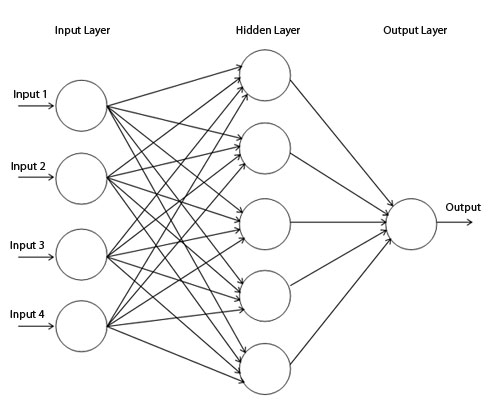

<script type="text/javascript" src="https://cdnjs.cloudflare.com/ajax/libs/mathjax/2.7.0/MathJax.js?config=TeX-AMS_CHTML"></script>

Have you ever wondered how neural networks work and how to implement one from scratch in Python?([Why are we using Python?](#why-use-python)) I am working for a project where neural networks are needed, so I read few things which are important about neural networks and now I am trying to share my knowledge about this fascinating field, this log is for you (the reader).
I’ll explain what neural networks are, how they process information, and how to code one using NumPy. You’ll also see a simple example of a neural network. By the end of this log, you’ll have a better understanding of neural networks and how to use them for your own projects.
I'll try to explain as good as I can, and will keep updating this log every time I learn something new from my daily learning or from your suggestions and feedback.

Okay lets dive into this with a quote by Richard Feyman - "What I cannot create, I do not understand".

## What is a Neural Network

In layman terms a neural network is a computer program that tries to copy how the human brain works. It can learn from data and find patterns or solve problems. For example, a neural network can look at pictures of cats and dogs and learn to tell them apart. A neural network has many parts called neurons that are connected to each other. Like in the image below 👇 we can call the nodes given as neurons, all are connected to each other. Each neuron can receive information from other neurons, do some math with it, and send it to other neurons. The more data a neural network gets, the better it can learn and improve its accuracy.




Our brain has many cells called neurons that can send signals to each other through connections called synapses. Each neuron can receive signals from many other neurons, and if the signals are strong enough, it can fire its own signal to other neurons. This way, our brain can process information and make decisions. A neural network has many parts called nodes that are similar to neurons. Each node can receive information from many other nodes, and if the information is important enough, it can pass it on to other nodes. This way, a neural network can find patterns or solve problems in data.

In technical terms a neural network is a machine learning model that consists of artificial neurons or nodes arranged in layers. It can perform nonlinear functions on input data and produce output data. For example, a neural network can classify images of cats and dogs based on pixel values. A neural network has an input layer, one or more hidden layers, and an output layer. Each node has weights, biases, and activation functions that determine how much information it passes to the next layer. The neural network learns by adjusting its weights and biases based on training data and feedback mechanisms such as backpropagation.

I was shown an introductory video on Neural Networks in my university class by my professor which cleared a lot of things about how neural networks work and what they are, I always preferr to watch a video instead of reading a log or blog like this, so **for those who want to watch a video instead**:

**Youtube video by Code.org:**

[](https://www.youtube.com/watch?v=JrXazCEACVo "How Neural Networks Work")

## Backpropagation

I can not explain this topic better than [Andrej Karpathy](https://www.youtube.com/@AndrejKarpathy) as he nailed it at explaining backpropagation!

But still for those who just want the definition and don't want the whole implementation and 2 hours of explanation:

Backpropagation is a method for training neural networks by adjusting their `weights` based on the `error rate` of their `output`. It works by propagating the error backwards from the `output layer` to the `input layer`, using the chain rule of calculus to calculate the gradients of each weight with respect to the loss function. By updating the weights in the opposite direction of the gradients, the neural network can learn to minimize its error and improve its performance.


In simple words, backpropagation is like learning from your mistakes. You try to do something (forward pass), you see how well or poorly you did (loss function), you figure out what you need to change to do better (gradients), and you make those changes (weight updates). You repeat this process until you are satisfied with your results.

**Youtube video by Andrej Karpathy:**

[](https://www.youtube.com/watch?v=VMj-3S1tku0 "The spelled-out intro to neural networks and backpropagation: building micrograd")


## Code Implementation

```python
# Import NumPy for matrix operations
import numpy as np

# Define the sigmoid activation function
def sigmoid(x):
  return 1 / (1 + np.exp(-x))

# Define the derivative of the sigmoid function
def sigmoid_derivative(x):
  return x * (1 - x)

# Define the input data
inputs = np.array([[0, 0, 1],
                   [0, 1, 1],
                   [1, 0, 1],
                   [1, 1, 1]])

# Define the output data
outputs = np.array([[0],
                    [0],
                    [1],
                    [1]])

# Set a random seed for reproducibility
np.random.seed(42)

# Initialize the weights randomly with mean 0
weights = 2 * np.random.random((3, 1)) - 1

# Set the number of iterations
epochs = 10000

# Train the neural network
for epoch in range(epochs):

    # Feed forward the input data
    layer_input = inputs
    layer_output = sigmoid(np.dot(layer_input, weights))

    # Calculate the error
    error = outputs - layer_output

    # Print the error every 1000 iterations
    if epoch % 1000 == 0:
        print(f"Error at iteration {epoch}: {np.mean(np.abs(error))}")

    # Backpropagate the error and adjust the weights
    adjustment = error * sigmoid_derivative(layer_output)
    weights += np.dot(layer_input.T, adjustment)

# Print the final output
print(f"Output after training: \n{layer_output}")
```
**Output**

```python
Output after training: 
[[0.00966808]
 [0.00786589]
 [0.99358863]
 [0.99211705]]
```

**Lets walk through the code line by line:**

```python
# Import NumPy for matrix operations
import numpy as np
```

This line imports the [NumPy](https://numpy.org/) library, which is a popular Python library for scientific computing. It provides various functions and methods for working with arrays and matrices, which are essential for neural network calculations.

```python
# Define the sigmoid activation function
def sigmoid(x):
  return 1 / (1 + np.exp(-x))
```

This line defines a function called [sigmoid](https://en.wikipedia.org/wiki/Sigmoid_function), which takes an input x and returns the output of the sigmoid activation function. The sigmoid function is a common activation function used in neural networks, which maps any input value to a value between 0 and 1.

```python
# Define the derivative of the sigmoid function
def sigmoid_derivative(x):
  return x * (1 - x)
```

This line defines another function called `sigmoid_derivative`, which takes an input `x` and returns the output of the derivative of the sigmoid function. The derivative of the sigmoid function is used in backpropagation to calculate how much each weight contributes to the error and how much it should be adjusted.

```python
# Define the input data
inputs = np.array([[0, 0, 1],
                   [0, 1, 1],
                   [1, 0, 1],
                   [1, 1, 1]])

# Define the output data
outputs = np.array([[0],
                    [0],
                    [1],
                    [1]])
```

The variable `inputs` is a NumPy array that contains four rows and three columns. Each row represents one training example with three input features. Another variable called `outputs`, which is also a NumPy array that contains four rows and one column. Each row represents one training example with one output value. We are using binary values (0 or 1) as inputs and outputs.

```python
# Set a random seed for reproducibility
np.random.seed(42)
```

This line sets a random seed for NumPy’s random number generator. This ensures that we get consistent results every time we run the code. So if you write something else instead of `42` you won't get the same output results that I got.

```python
# Initialize the weights randomly with mean 0
weights = 2 * np.random.random((3, 1)) - 1
```

This line initializes a variable called weights, which is a [NumPy array](https://numpy.org/doc/stable/reference/generated/numpy.array.html) that contains the weights for each connection between the input layer and the output layer. The shape of this array is (3, 1), which means it has three rows and one column. Each row corresponds to one input feature and each column corresponds to one output neuron.

To initialize the weights, we use NumPy’s random function to generate random numbers between 0 and 1. We then multiply these numbers by 2 and subtract 1 to get numbers between -1 and 1. This ensures that the mean of the weights is 0, which helps with the learning process.

We initialize the weights randomly because we don’t know what values will work best for our neural network. By starting with random values, we allow the network to learn from its errors and adjust the weights accordingly.

```python
# Set the number of iterations
epochs = 10000
```

This line sets a variable called epochs, which is the number of times we want to train the neural network on the entire dataset. Each iteration consists of two steps: feedforward (or Frontpropagation) and backpropagation.

```python
# Train the neural network
for epoch in range(epochs):

    # Feed forward the input data
    layer_input = inputs
    layer_output = sigmoid(np.dot(layer_input, weights))
```

These lines start a for loop that iterates over the number of epochs. Inside the loop, we first perform feedforward (or Frontpropagation), which is the process of making predictions based on the input data and the current weights (explained in detail below). We assign the input data to a variable called `layer_input`, and then we use [NumPy’s dot function](https://numpy.org/doc/stable/reference/generated/numpy.dot.html) to multiply it with the weights. This gives us a weighted sum of inputs for each neuron in the output layer. We then apply the sigmoid function to this sum to get a value between 0 and 1 for each neuron. We assign this value to a variable called `layer_output`.

```python
# Calculate the error
    error = outputs - layer_output

    # Print the error every 1000 iterations
    if epoch % 1000 == 0:
        print(f"Error at iteration {epoch}: {np.mean(np.abs(error))}")
```

These lines calculate and print the error of our predictions. The error is simply the difference between the actual output values and our predicted output values. We use NumPy’s [mean](https://numpy.org/doc/stable/reference/generated/numpy.mean.html) and [absolute](https://numpy.org/doc/stable/reference/generated/numpy.absolute.html) functions to get an average absolute error for each iteration. We print this error every 1000 iterations.

```python
   # Backpropagate the error and adjust the weights
    adjustment = error * sigmoid_derivative(layer_output)
    weights += np.dot(layer_input.T, adjustment)
```

These lines perform backpropagation, which is the process of adjusting the weights based on how much they contribute to the error. The goal of backpropagation is to minimize the error by finding the optimal values for the weights.

<a href="#backpropagation" style="text-decoration:none;">as explained above ☝️</a>

To do this, we first calculate an adjustment value for each weight. The adjustment value is proportional to the error and the derivative of the activation function (sigmoid function). The error tells us how far off our prediction is from the actual output. The derivative of the activation function tells us how sensitive our output is to a change in the input. By multiplying these two values, we get a measure of how much each weight affects the error.

We use NumPy’s [multiply](https://numpy.org/doc/stable/reference/generated/numpy.multiply.html) function to element-wise multiply the error array and the sigmoid_derivative array. We assign this result to a variable called adjustment.

Next, we update each weight by adding a fraction of its adjustment value. This fraction is called the learning rate and it controls how fast or slow we want our neural network to learn. A higher learning rate means faster learning but also more risk of overshooting or oscillating around the optimal value. A lower learning rate means slower learning but also more stability and accuracy.

*Here the .T attribute in layer_input.T is a shorthand for transposing a NumPy array. Transposing an array means swapping its rows and columns. For example, if we have an array like this:*

```python
[[0, 0, 1],
 [0, 1, 1],
 [1, 0, 1],
 [1, 1, 1]]
```

*The transpose woule be:*

```python
[[0, 0, 1, 1],
 [0, 1, 0 ,1],
 [1 ,1 ,1 ,1]]
```

We use NumPy’s dot function to matrix multiply the transpose of the layer_input array and the adjustment array. This gives us an array with the same shape as the weights array. We then add this array to the weights array using NumPy’s add function.

By doing this, we are applying a simple optimization algorithm called gradient descent, which moves the weights in the direction that reduces the error. We repeat this process for each iteration until we reach a minimum error or a maximum number of iterations.

```python
# Print the final output
print(f"Output after training: \n{layer_output}")
```

**Lastly** this line prints the final output of our neural network after training. It should be close to the actual output values we defined earlier.

### What we learned from the Code:

This code shows how to create a simple neural network in Python with one input layer and one output layer. It explains how to initialize the weights randomly, how to feed forward the input data and make predictions, how to calculate and print the error, how to backpropagate the error and adjust the weights, and how to print the final output. It also demonstrates how to use NumPy for matrix operations and how to use the sigmoid function as an activation function

This code makes predictions based on the input data and the current weights. The predictions are stored in the variable layer_output, which is a NumPy array that contains the output values for each input example. We print these predictions at the end of the code.

The output after training should be close to the actual output values we defined earlier in the variable outputs.

### Why did we even write/do this?

We wrote and studied this neural network to learn a function that can map inputs to outputs. The outputs we have are the labels or targets that we use to train and evaluate the neural network. The neural network tries to learn the patterns and relationships between the inputs and outputs from the data. Once the neural network is trained, we can use it to make predictions on new inputs that it has not seen before. For example, if we write a neural network to recognize handwritten digits, we can use images of digits and their corresponding labels as inputs and outputs for training. After training, we can use the neural network to classify new images of digits that it has not seen before.

To do a more in-depth code implementation you can read [A Neural Network in 11 lines of Python (Part 1)](https://iamtrask.github.io/2015/07/12/basic-python-network/) by iamtrask.

## Difference between Backpropagation & Frontpropagation

Okay so I was reading a blog where we get to learn to build a neural network in F#. I saw the term Frontpropagation, and I was so confused by this term, so decided to add this in my log. Ill try to explain this as easy as possible, also not missing the technical and important terms. Again, feedback is much appreciated!

Backpropagation (as explained above) is different from frontpropagation because it goes in the opposite direction, from output to input. Backpropagation is used to adjust the weights and biases of the neural network based on the error rate or loss that we get from frontpropagation. Let me try to explain it in simple terms with another example.

Suppose we have a neural network that can predict whether a person has Parkinson's or not based on how they speak(sound). The input data is a number that represents the sound wavelength, and the output is a probability between 0 and 1 that indicates how likely the person has Parkinson's. The higher the probability, the more likely they have Parkinson's.

The neural network has two layers: an input layer with one neuron and an output layer with one neuron. The output neuron uses a sigmoid activation function, which squashes any number between 0 and 1. The input neuron does not have any activation function (orange box), so it just passes its input value to the output neuron.


The weights (red box) and biases (green box) of this neural network are initialized randomly. For example:

```
w = 0.5 b = -0.2
```

Frontpropagation is simply multiplying the input by `w` and adding `b`, then applying the sigmoid function:


$$ output = sigmoid(input * w + b) $$

For example, if we have an input of 100 (which means high wavelength), we get an output of:

$$ output = sigmoid(100 * 0.5 - 0.2) = sigmoid(49.8) = 1 $$

This means our neural network predicts that this person has a very high probability of having Parkinson's.

However, suppose we know that this person does not have Parkinson's (the true label is 0). This means our prediction is wrong and our loss is high. We can measure our loss using a function called [binary cross-entropy](#binary-cross-entropy), which compares our prediction with the true label:

```
loss = - (true_label * log(prediction) + (1 - true_label) * log(1 - prediction))
```

For example, for this case:

$$ loss = - (0 * log(1) + (1 - 0) * log(1 - 1)) = \\infty $$

This means our loss is very bad and we need to improve our model.

Backpropagation is how we improve our model by adjusting `w` and `b` based on how much they contribute to the loss. We do this by calculating how much each parameter affects the loss using a technique called partial derivatives or gradients:

### 🚨 Math Alert (Will cover this topic in sperate log as Gradient Descent is a very fascinating and huge topic to study)

$$ dw = \frac{d(\text{loss})}{d(w)} \quad db = \frac{d(\text{loss})}{d(b)} $$

These gradients tell us how much we need to change `w` and `b` to reduce the loss.

We can use a rule called gradient descent to update w and b using these gradients:

$$  \quad w_{\text{new}} = w_{\text{old}} - \alpha \cdot dw \quad b_{\text{new}} = b_{\text{old}} - \alpha \cdot db $$

$$ \text{here } \alpha = \text{alpha} $$

where alpha is a small positive number called learning rate that controls how big of a step we take towards minimizing the loss.

For example, if

``` 
alpha is 0.01,

dw is -10,

and db is -5,
```

we get:

$$ w_{\text{new}} = w_{\text{old}} - \alpha \cdot dw = 0.5 - 0.01 \cdot (-10) = 0.6 $$

$$ b_{\text{new}} = b_{\text{old}} - \alpha \cdot db = -0.2 - 0.01 \cdot (-5) = -0.15 $$

This means we increase `w` slightly and decrease `b` slightly. (still confused with the math, will update this section later).

We repeat this process for many inputs until we find optimal values for w and b that minimize the loss for all inputs.

## Summary: What I learned from my log

This was a great topic to learn! I had an idea earlier what neural networks were but did not have a clear understanding of the topic, I did have knowledge of couple of youtube videos which i watched about neural networks but I did not have the courage to tell someone that I know what neural networks are. As my current research project requires me to learn, study and use neural networks I started reading blogs and watching tutorials. There were plenty of articles which did not come in the scope of this log, but helped me understand what neural networks are! This is the longest log I've written till now, and this log has a proper implementation as well as explanation of what the topic is. As I am finishing this log, I feel that I am imporoving my understanding towards machine learning and aritifial intelligence, and I feel as I write more logs, I can boost my skills to explain a topic to someone!

Concluding, the <a href="#why-did-we-even-writedo-this" style="text-decoration:none;">conclusion for the code that I've written is above ☝️</a>, I wrote that conclusion because I too had questions like: "Why am I writing this code?", "What use does this have?". Now that i have studied a tiny portion of this topic, I will continue to learn more about it and update this log.


Signing of 23 March, 2023

## Annotation

### Why Use Python?

Python is a widely used programming language for data analysis/machine learning because it is easy to learn and read. It also has many libraries that offer various tools for working with different types of data. For example: you can use NumPy to manipulate large arrays of numbers; Pandas to organize data into tables; Scikit-learn to apply machine learning algorithms; TensorFlow to build neural networks; Matplotlib to create graphs and charts. You can also use Python with other languages or platforms if you need to. Python helps you perform complex tasks with less code and more efficiency. Also Python is beginner friendly and almost uses English like sentences, therefore easy for anyone learning it 😄.

### Binary Cross-Entropy

Binary cross-entropy is a way of measuring how well a model can predict the correct class for a given example. For example, if you have a model that predicts whether an email is spam or not, binary cross-entropy tells you how confident the model is about its prediction and how close it is to the actual answer.

Explaining more, if an email is spam (actual class = 1) and the model predicts a high probability of being spam (predicted probability = 0.9), then binary cross-entropy will give a low score because the prediction is close to the expected value. But if an email is not spam (actual class = 0) and the model predicts a high probability of being spam (predicted probability = 0.9), then binary cross-entropy will give a high score because the prediction is far from the expected value.

The formula for binary cross-entropy looks like this:

$$ L(t, p) = -(t \log(p) + (1 - t) \log(1 - p)) $$

where `t` is the true label (0 or 1) and `p` is the predicted probability of the positive class (between 0 and 1).


**[Understanding binary cross-entropy / log loss: a visual explanation](https://towardsdatascience.com/understanding-binary-cross-entropy-log-loss-a-visual-explanation-a3ac6025181a) by Daniel Godoy, is a great read to understand this!**

## References

- [Machine Learning for Beginners: An Introduction to Neural Networks](https://victorzhou.com/blog/intro-to-neural-networks/#an-example-feedforward) by Victor Zhou
- [Backpropagation for Dummies](https://medium.com/analytics-vidhya/backpropagation-for-dummies-e069410fa585) by Diletta Goglia
- [A Guide to Loss Functions for Deep Learning Classification in Python](https://builtin.com/data-science/loss-functions-deep-learning-python) by Sadrach Pierre
